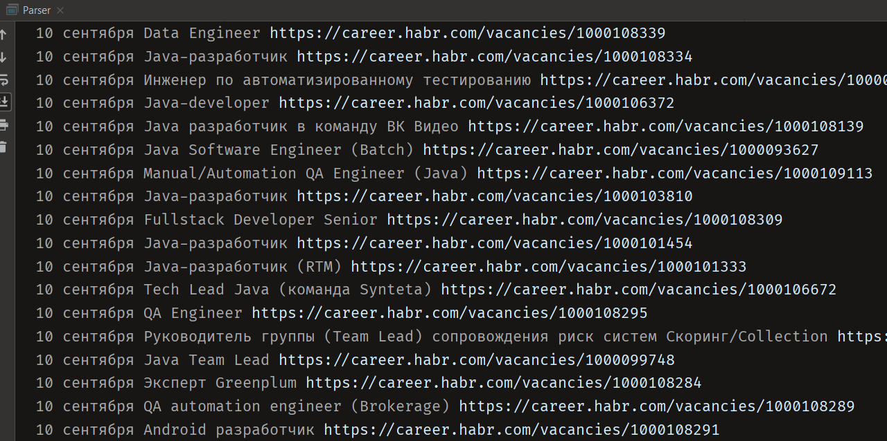

Project "Agregator Java vacancies".

The program reads all vacancies from the first five pages of https://career.habr.com related to Java and records them in the pSql database.
The system starts on schedule - once in a minute.
The quartz startup period can be specified in app.properties.

Technology stack: Java, JDBC, pSql, quartz

