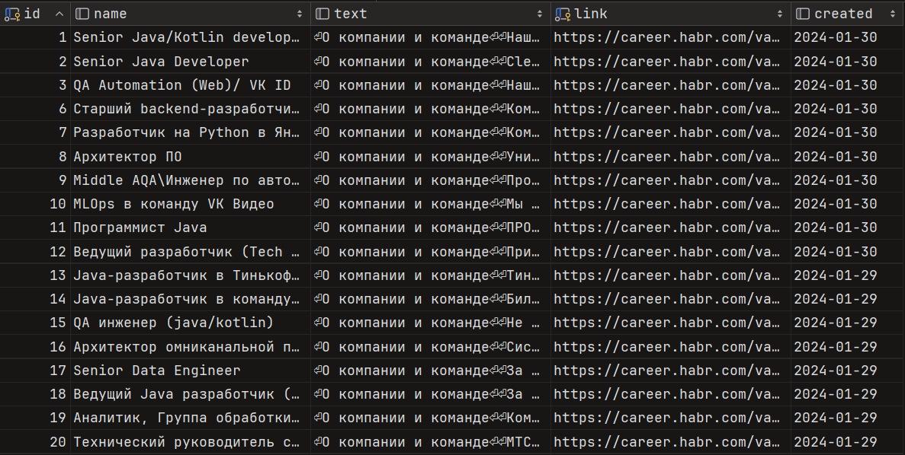

## Job aggregator `career.habr.com`
- The program reads latest vacancies from the first 5 pages of https://career.habr.com 
related to Java and records them in the `PostgreSQL` database.

- The system starts on schedule - once in a minute.

- The `Quartz` startup period can be specified in app.properties `time`

## Usage
- To run the program, run the main class `Grabber` 

## Technology stack:
- ##### Java, JDBC, PostgreSQL, Quartz, Jsoup

